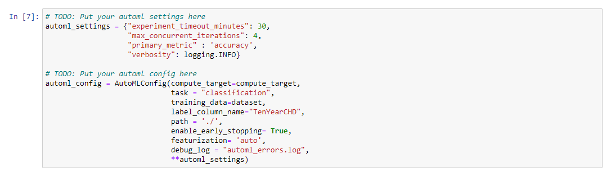

# Coronary Heart Disease Prediction

This is the Capstone Project of Udacity Machine Learning with Microsoft Azure Nanodegree. In this project we were asked to use the dataset of our choice to solve the desired machine learning problem. We have to train the machine learning model using AutoML and Hyperdrive after that we have to deploy the best model and consume it's endpoint to get the desired result.

## Dataset

### Overview

In this project i uses the Framingham Heart Study Dataset available on [Kaggle](https://www.kaggle.com/amanajmera1/framingham-heart-study-dataset). This dataset is actually firstly used to build the Framingham Risk Score which is a gender-specific algorithm used to estimate  the 10-year cardiovascular of an individual. The main task is to predict the risk of developing coronary heart disease in the next 10 years. This is a very popular study and the latest version of the dataset is also available on National Intitude of Health [website](https://biolincc.nhlbi.nih.gov/teaching/). an expert panel of the National Heart, Lung, and Blood Institute, which is part of the National Institutes of Health (NIH), USA is actively working on the problem and publishing the latest version actively and making it publically available for research purposes. The Dataset consists of 16 Columns and 4240 Rows. 

### Task

The task is to create a binary classification model to predict the risk of developing coronary heart disease in the next 10 years. Using the Azure ML SDK we will train the model using both AutoML and Hyperdrive. Finally we compare the models and deploy the best model as a webservice. In the case of Hyperdrive i uses logistic regression as a classification algorithm.

The dataset contains 15 features that can be used for prediction. The remaining one last column "TenYearCHD" is label or Output.

| Variable | Description  |
| :-----: | :-: |
| male | Participant gender |
| age | Age at exam (years) |
| education | Highest degree |
| currentSmoker | Current cigarette smoking at exam |
| cigsPerDay| Number of cigarettes smoked each day |
| BPMeds | Use of Anti-hypertensive medication at exam |
| prevalentStroke | Prevalent Stroke |
| prevalentHyp | Prevalent Hypertensive. Subject was defined as hypertensive if treated or if second exam at which mean systolic was >=140 mmHg or mean Diastolic >=90 mmHg |
| diabetes | Diabetic according to criteria of first exam treated or first exam with casual glucose of 200 mg/dL or more |
| totChol | Serum Total Cholesterol (mg/dL) |
| sysBP | Systolic Blood Pressure (mean of last two of three measurements) (mmHg) |
| diaBP | Diastolic Blood Pressure (mean of last two of three measurements)(mmHg) |
| BMI | Body Mass Index, weight in kilograms/height meters squared |
| heartRate | Heart rate (Ventricular rate) in beats/min |
| glucose | Casual serum glucose (mg/dL) |

### Access

I downloaded the dataset from kaggle and uploaded it into github repository. For the Hyperdrive part i done some preprocessing manually on excel and uploaded it to my github repository. Finally i registered the datasets in Azure ML using TabularDatsetFactory in the notebook.

<p align="center">
  
</p>

<p align="center">
  
</p>

## Automated ML

I used the following AutoML Configuration Settings.

<p align="center">
  
</p>

| Configuration | Value | Explanation |
| :-----: | :-----: | :-: |
| experiment_timeout_minutes | 30 | Maximum amount of time in minutes that all iterations combined can take before the experiment terminates 30 minutes gives me better results |
| max_concurrent_iterations | 4 | To manage child runs in parallel shoul be less than maximum number of nodes of Compute Cluster |
| primary_metric | accuracy | Metric we want to optimize |
| compute_target | compute_target | Compute Cluster used for training the model |
| task | classification | As it is a binary classification problem the output can be either 0 or 1 |
| label_column_name | TenYearCHD | The output variable in this case the Coronary Heart disease in next 10 years either 0 or 1 |
| training_data | dataset | Registered training dataset Framingham Heart Disease Dataset in this case |
| enable_early_stopping | True | used to terminates early if the score is not improving |
| featurization | auto | define wheter to do featurization automatically handeled by AutoML |
| debug_log | automl_errors.log | log file to track errors in the automl process |

### Results

### Old Notebook Results from automl.ipynb
The best model obtained from AutoML is SparseNormalizer XGBoostClassifier with an Accuracy of 84.835%.

Below Screenshots displays the completed AutoML Run showing the run and the Rundetails widget is completed.

<p align="center">
  
</p>

<p align="center">
  
</p>

Below Screenshots displays the best AutoML Child Run Completed. It's Accuracy, Metrics and RunId.

<p align="center">
  
</p>

<p align="center">
  
</p>

<p align="center">
  
</p>

We can improve the model results by adding crossvalidation to avoid model overfitting, increase the experiment timeout minutes and enable deeplearning in AutoML configuration.

### New Notebook Results from automl_v2.ipynb

The best model obtained from AutoML is MaxAbsScaler RandomForest with an Accuracy of 84.812%.

Below Screenshots displays the completed AutoML Run showing the run and the Rundetails widget is completed.

<p align="center">
  
</p>

<p align="center">
  
</p>

Below Screenshots displays the best AutoML Child Run Completed. It's Accuracy, Metrics and RunId.

<p align="center">
  
</p>

<p align="center">
  
</p>

<p align="center">
  
</p>

<p align="center">
  
</p>

We can improve the model results by adding crossvalidation to avoid model overfitting, increase the experiment timeout minutes and enable deeplearning in AutoML configuration.

The Properties of the best model are as below.
```
Pipeline(memory=None,
         steps=[('datatransformer',
                 DataTransformer(enable_dnn=None, enable_feature_sweeping=None,
                                 feature_sweeping_config=None,
                                 feature_sweeping_timeout=None,
                                 featurization_config=None, force_text_dnn=None,
                                 is_cross_validation=None,
                                 is_onnx_compatible=None, logger=None,
                                 observer=None, task=None, working_dir=None)),
                ('MaxAbsScaler', MaxAbsScaler(copy...
                 RandomForestClassifier(bootstrap=False, ccp_alpha=0.0,
                                        class_weight=None, criterion='gini',
                                        max_depth=None, max_features='sqrt',
                                        max_leaf_nodes=None, max_samples=None,
                                        min_impurity_decrease=0.0,
                                        min_impurity_split=None,
                                        min_samples_leaf=0.01,
                                        min_samples_split=0.10368421052631578,
                                        min_weight_fraction_leaf=0.0,
                                        n_estimators=10, n_jobs=1,
                                        oob_score=False, random_state=None,
                                        verbose=0, warm_start=False))],
         verbose=False)
```

## Hyperparameter Tuning

I choosed the LogisticRegression Algorithm as it is a binary Classification problem. We are trying to predict wether a patient has a potential risk of coronary heart disease in the next 10 years. The Hyperparameters of the model that are tuned using Hyperdrive are:

- --C: the inverse of Regularization strength helps prevent over-fitting of the model. Values randomly used are (0.002, 0.02, 0.2, 2.0).
- max_iter: the maximum number of iterations to converge the model. Values randomly used are (100, 200, 300, 500).
- Bandit Policy: as an early termination policy to effectively utilize the computing resources by terminating the poor performing runs.

<p align="center">
  
</p>

### Results

The best Hyperdrive run gives an Accuracy of 85.4% with regularization strength of 2.0 and Max Iterations 500.

Below Screenshots shows the Hyperdrive Run and Run Widget is Completed.

<p align="center">
  
</p>

<p align="center">
  
</p>

Below Screenshots shows the Best Hyperdrive Run detials like Accuracy, Metrics and RunId.

<p align="center">
  
</p>

<p align="center">
  
</p>

The model results can be improved by applying feature engineering and other classification algorithms like Random Forest, Support Vector Machine and KNNs.

## Model Deployment

The model i deployed is the best AutoML Model with an accuracy of 84.835%.

Below Screenshots shows the registered model and the Enpoint status Healthy.

<p align="center">
  
</p>

<p align="center">
  
</p>

The sample input is provided in the json format.

```
data = {
    "data": [
        {
            'male': 0,
            'age': 55,
            'education': 4 ,
            'currentSmoker': 1,
            'cigsPerDay': 20,
            'BPMeds': 0,
            'prevalentStroke': 0,
            'prevalentHyp': 0,
            'diabetes': 0,
            'totChol': 285,
            'sysBP': 175,
            'diaBP': 84,
            'BMI': 25.50,
            'heartRate': 93,
            'glucose': 87
        },
        {
            'male': 1,
            'age': 40,
            'education': 4 ,
            'currentSmoker': 0,
            'cigsPerDay': 30,
            'BPMeds': 0,
            'prevalentStroke': 0,
            'prevalentHyp': 0,
            'diabetes': 0,
            'totChol': 228,
            'sysBP': 121,
            'diaBP': 110,
            'BMI': 30.30,
            'heartRate': 80,
            'glucose': 80
        }
    ]
}
```

The above data can be now used to query the webservice endpoint as below.

```
data_sample = json.dumps(data)

scoring_uri = service.scoring_uri
input_data = data_sample

# Set the content type
headers = {'Content-Type': 'application/json'}

# Make the request and display the response
response = requests.post(scoring_uri, input_data, headers=headers)

response.json()
```

As a response we will get result of either 0 or 1.

## Screen Recording

https://youtu.be/hwLass4GbSU
